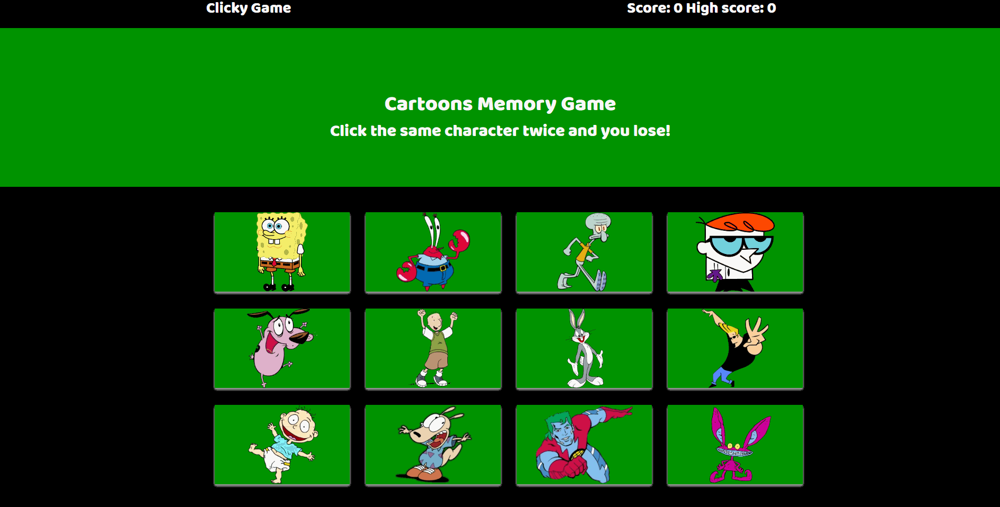

# Memory Game

A memory game I made utilizing react. Click on every cartoon character once without clicking the same character twice and you win!

This app uses react to render individual components that reacts without the need of reloading the browser. 

You can check out the app here. https://lijaack.github.io/Memory-Game/

## Built With
* HTML
* CSS
* Bootstrap
* node.js
* Javascript
* React

